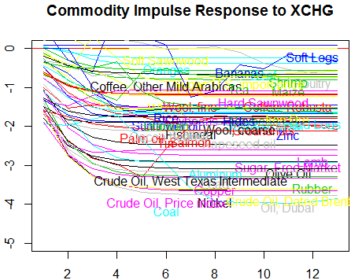
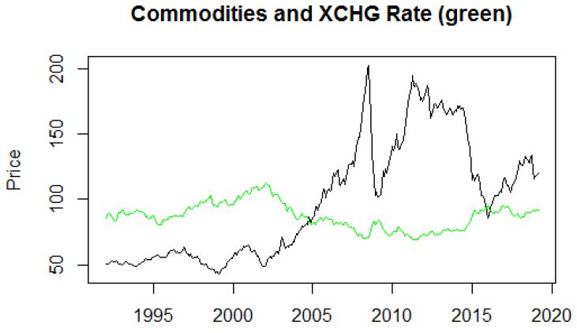
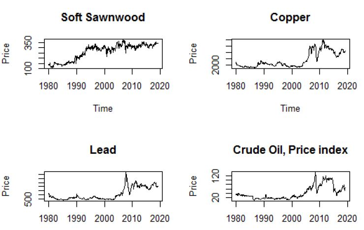
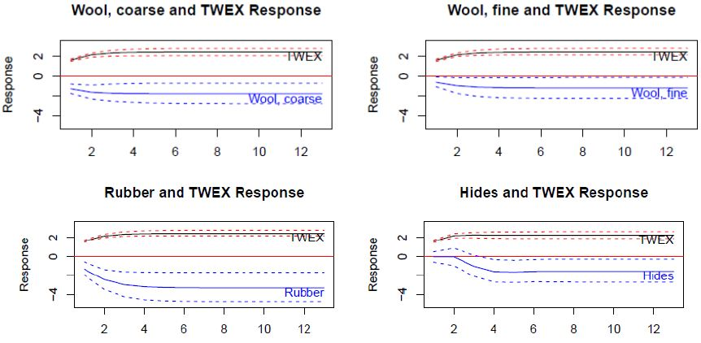

# commodityResponseXchgRate
Studying the response of commodity prices to exchange rate variance.  
Here's a chaotic graph I made for fun:  
  
- **Goal**: Determine which commodities exhibit price elasticity to changes in exchange rate. 
- **Methodology**: Monthly commodity price data is from the IMF, time period is Jan 1980 - March 2019. Commodities include 23 foods, 4 beverages, 9 agricultural products, and 5 fuels. Exchange rate data is from FRED. A Bi-VAR model is used to generate Impulse Response Functions (IRFs) and dynamic elasticities. 
- **Conclusion**: In general, fuels are very elastic and agricultural products are relatively inelastic. Elasticity of metal prices seem to depend on whether the U.S. is a major importer, and whether it eventually exports refined products made from the imported raw metal. 
  - Demand plays a large role in the elasticity of all commodities, but the ability to switch the source of import for a resouce results in absorption of shocks in demand, regardless of the source of those shocks. 
---
### Weighted Average Commodity price vs. Trade Weighted U.S. Dollar Index

### Some Commodity prices over time

### Statistical Tests for Country MSCI Index vs. USA Index

